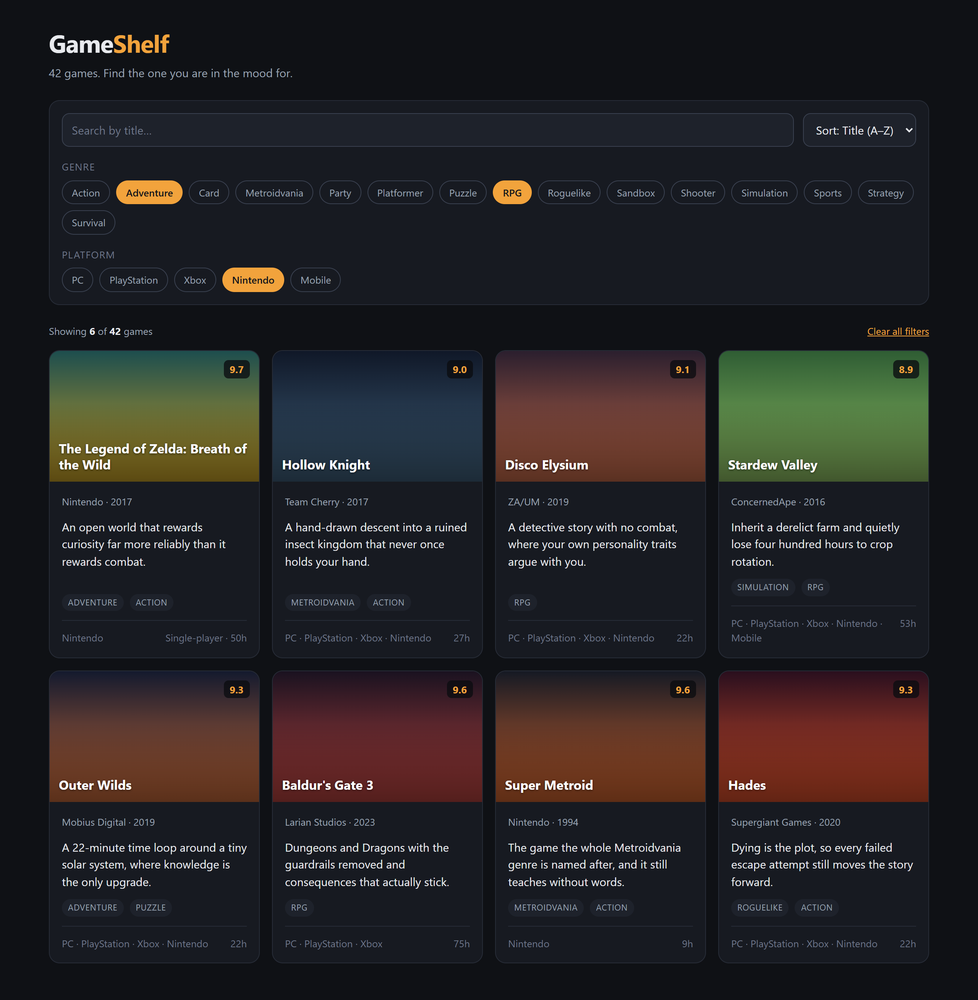
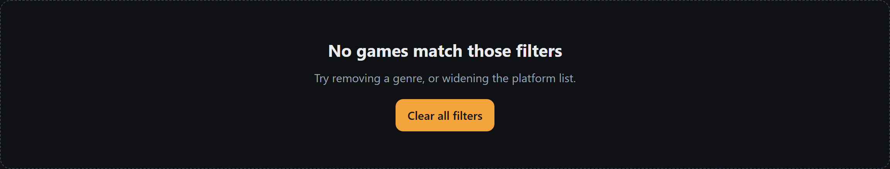
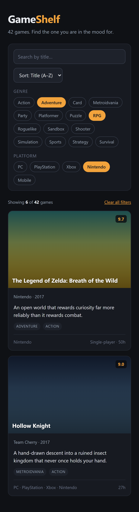

# GameShelf — the design

**You are not designing this. It is designed.** Your job is to build it.

This is how frontend work actually arrives in a job: somebody hands you a picture and a set
of values, and you make the browser produce it. Learning to hit a spec exactly is a real
skill, and it is more useful than inventing your own layout every time.

Every colour, size, spacing step and radius is already defined in
[`tokens.css`](tokens.css), which `index.html` loads before your `styles.css`. Use
`var(--space-4)`, not `16px`. If you catch yourself typing a hex code, stop — it is in there.

---

## Layout

| | |
|---|---|
| Page | centred, `max-width: 1200px`, padding `--space-6` top / `--space-5` sides / `--space-7` bottom |
| Background | `--bg` on the body |
| Grid | Flexbox with `flex-wrap: wrap` and `gap: --space-4` |
| Card | `flex: 1 1 260px` — no fixed width, no `max-width` |
| Media queries | **none.** See "Narrow screens" at the bottom. |

## Header

- `GameShelf` at `--step-3`, `letter-spacing: -0.02em`. "Shelf" is `--accent`, "Game" is `--text`.
- Tagline underneath at `--step-0` in `--text-muted`.

## Toolbar

One panel: `--surface` background, `1px solid --border`, `--radius-lg`, `--space-4` padding.
Inside it, a vertical stack with `gap: --space-4`:

1. **Row one** — the search input (`flex: 1 1 240px`, so it grows) and the sort `<select>`
   (natural width). Both: `--surface-raised` background, `1px solid --border-strong`,
   `--radius`, `10px --space-3` padding, inherited font.
2. **Genre row** — a `--step--1` uppercase label in `--text-faint` with `letter-spacing:
   0.06em`, and the chips **underneath it**, in their own wrapping container.
3. **Platform row** — same shape.

The label sits *above* its chips, not beside them. That is a deliberate choice, not a
stylistic one: a label in a fixed-width column beside the chips looks fine on a laptop and
falls apart on a phone, and fixing that would need a media query you have not been taught
yet. Stacked, it is correct at every width with no extra code.

Keep the chips in their own wrapping container rather than loose in the row, so a chip that
wraps onto a second line lines up with the chip above it instead of sliding under the label.

### Chips

| State | Look |
|---|---|
| Off | transparent background, `1px solid --border-strong`, `--text-muted`, `--radius-pill`, `5px --space-3` padding, `--step--1` |
| Hover | border `--text-muted`, text `--text` |
| On | background and border `--accent`, text `--accent-ink`, `font-weight: 600` |

Use real `<button>` elements and mark the selected ones with `aria-pressed="true"`. You get
keyboard support for free, and `.chip[aria-pressed="true"]` is a tidy way to style the on
state without juggling a second class.

## Results bar

Sits between the toolbar and the grid. `--step--1`, `--text-muted`, the two ends pushed
apart. `Showing 6 of 42 games` on the left with both numbers in `--text`; a `Clear all
filters` link-button on the right in `--accent`, underlined.

## The card

`--surface` background, `1px solid --border`, `--radius-lg`, `overflow: hidden` so the cover
corners get clipped. On hover: border goes to `--border-strong` and the card lifts 2px.

**Cover** — `aspect-ratio: 16 / 10`, background is the game's own gradient:
`linear-gradient(coverFrom, coverTo)`, set from JavaScript.

- A dark overlay from the bottom (`rgba(0,0,0,0.55)` fading out at 60%) so the title stays
  readable over a pale gradient. A pseudo-element does this well.
- **Title** sits bottom-left, `--step-1`, white, `line-height: 1.25`, with a soft text-shadow.
- **Rating** sits top-right: `--accent` text on `rgba(10,12,16,0.78)`, `--radius-sm`,
  `font-weight: 700`, `--step--1`.

**Body** — `--space-4` padding, a vertical stack with `gap: --space-3`:

1. `Developer · Year` — `--step--1`, `--text-muted`
2. Blurb — `--step-0`, `--text`. Give it `flex: 1` so every card in a row ends up the same
   height with the footer pinned to the bottom.
3. Genre tags — `--surface-raised` pills, `--step--2`, uppercase, `letter-spacing: 0.04em`,
   `--text-muted`
4. Footer — separated by a `1px solid --border` top edge, `--space-3` above it. Platforms
   on the left joined with ` · `, player mode and hours on the right. `--step--1`,
   `--text-faint`.

## Empty state

When nothing matches, replace the grid contents with a single full-width panel: `1px dashed
--border-strong`, `--radius-lg`, `--space-7 --space-5` padding, centred text.

- Heading at `--step-2`: **No games match those filters**
- A line of `--text-muted` underneath: *Try removing a genre, or widening the platform list.*
- A solid `--accent` button with `--accent-ink` text, `--radius`, `font-weight: 600`:
  **Clear all filters**

## Narrow screens — you get this for free

**There is not one media query in this design, and you are not expected to write one.**
Media queries come up in *Advanced HTML and CSS*, two courses from now. Everything above is
built so that Flexbox handles the resizing on its own.

Here is the whole trick. `flex: 1 1 260px` says *"aim for 260px, but grow to fill space, and
shrink if you have to."* Combined with `flex-wrap: wrap`, the browser fits as many cards per
row as will go and moves the rest down. You never tell it how many columns to use:

| Page width | Cards per row |
|---|---|
| 1200px | 4 |
| 900px | 3 |
| 700px | 2 |
| 500px and below | 1 |

The toolbar does the same thing. The search input and the sort select sit in a wrapping row,
so when there is no longer room for both, the select drops onto its own line by itself. The
chips wrap the same way. The filter labels are already above their chips, so nothing has to
move.

This is called **natural responsiveness**, and it is genuinely the first thing Odin teaches
you in the responsive design section later — before media queries, because most layouts need
far fewer of them than people assume.

So for the narrow-screen step: **squash your browser window and check.** If you built the
above faithfully, it should already work, and your job is to find the places where it does
not. Something with a fixed `width`, a long unbroken string, or a `min-width` bigger than the
screen is usually the culprit. Nothing should ever scroll sideways.

## Focus states

Do not delete the focus ring. Tab through your own page: if you cannot tell where you are,
neither can anyone using a keyboard. `--focus` is in the tokens for exactly this. A
`2px solid var(--focus)` outline with `2px` of offset, on `:focus-visible`, is plenty.

---

## What is still yours

The design is settled; **the CSS is not written for you**. You still choose the class names,
the selectors, how you structure the markup, and how you get Flexbox to do the above. That
is the CSS Foundations and Flexbox material from the course, and it is half of what you just
learned — skipping it would be a waste.

Match the mockup as closely as you can. When you think you are done, put your page and the
mockup side by side on screen and hunt for the differences. There will be more than you
expect, and noticing them is the skill.
